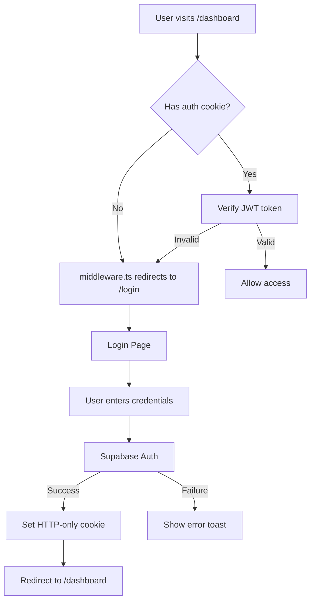
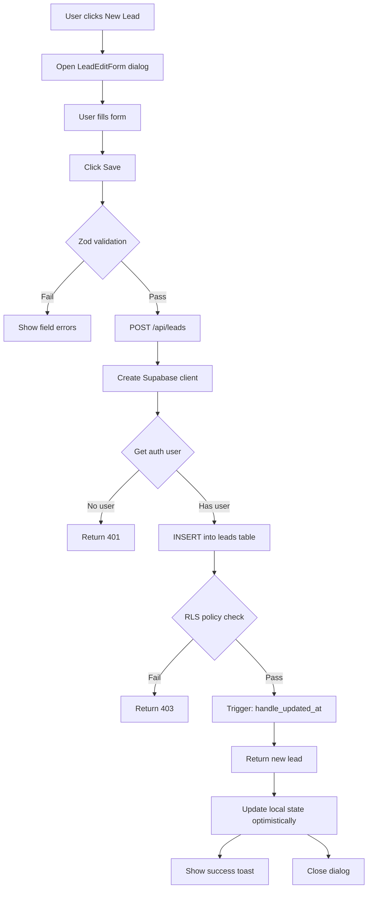
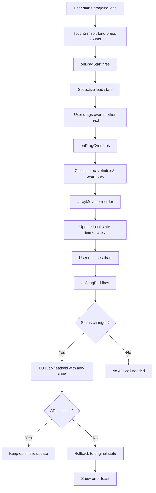
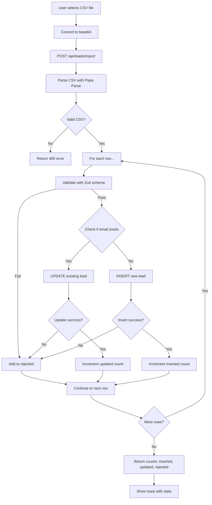
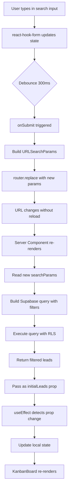
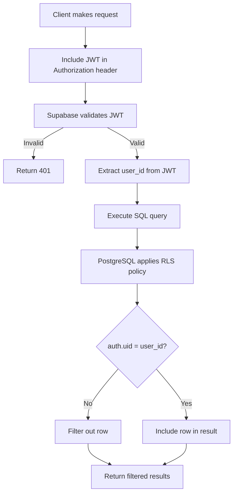
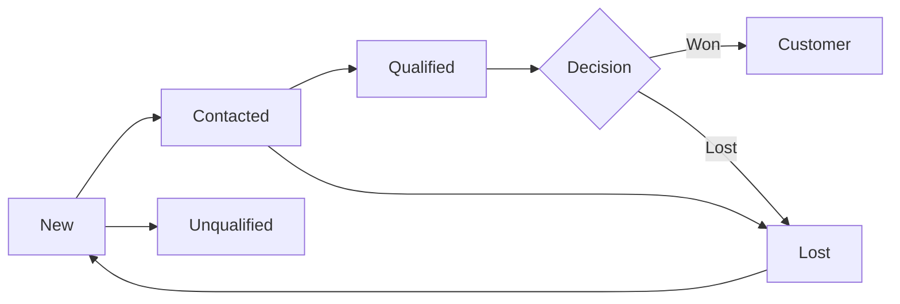
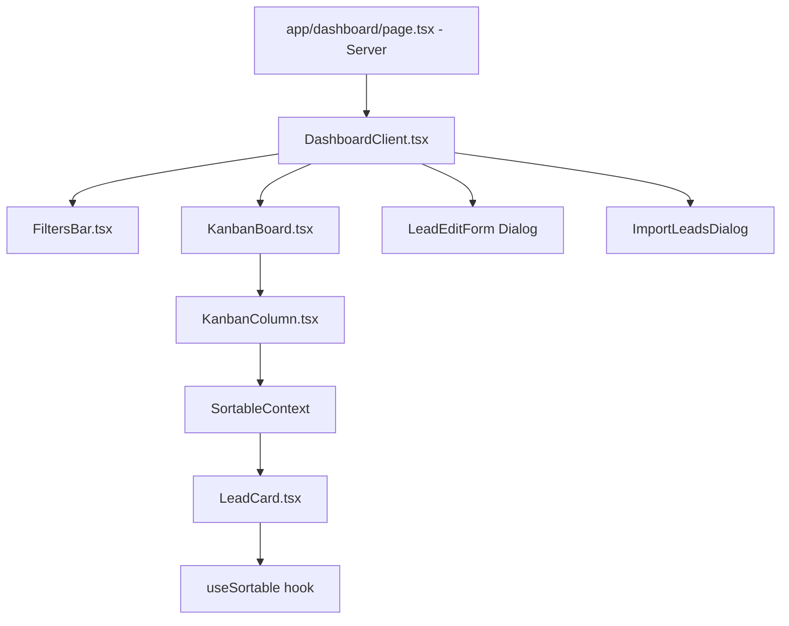

# System Flowcharts

Visual diagrams showing how the system works.

---

## 1. Authentication Flow

---

## 2. Lead CRUD Flow

---

## 3. Drag and Drop Flow

---

## 4. Import CSV Flow

---

## 5. Filter Flow

---

## 6. Row-Level Security

---

## 7. Lead Lifecycle

**Status Meanings:**
- **New:** Just imported/created
- **Contacted:** First outreach made
- **Qualified:** Met criteria (budget, authority, need, timeline)
- **Customer:** Deal closed
- **Lost:** Rejected or went with competitor
- **Unqualified:** Doesn't meet criteria

---

## 8. Component Hierarchy

---

**Last Updated:** 2025-10-23
